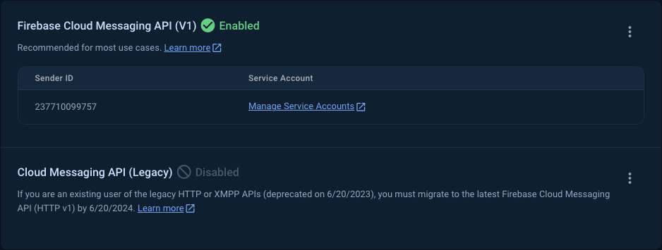
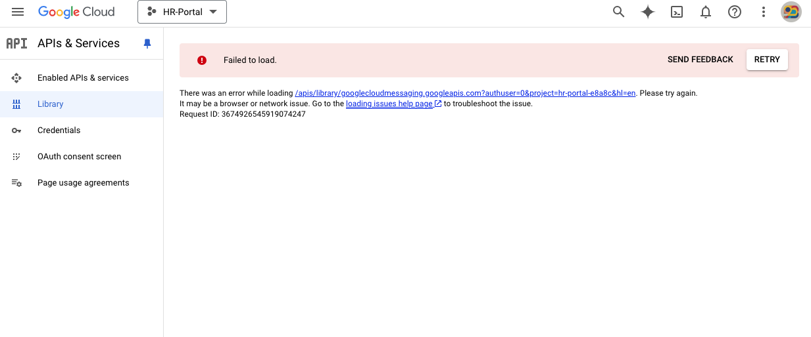
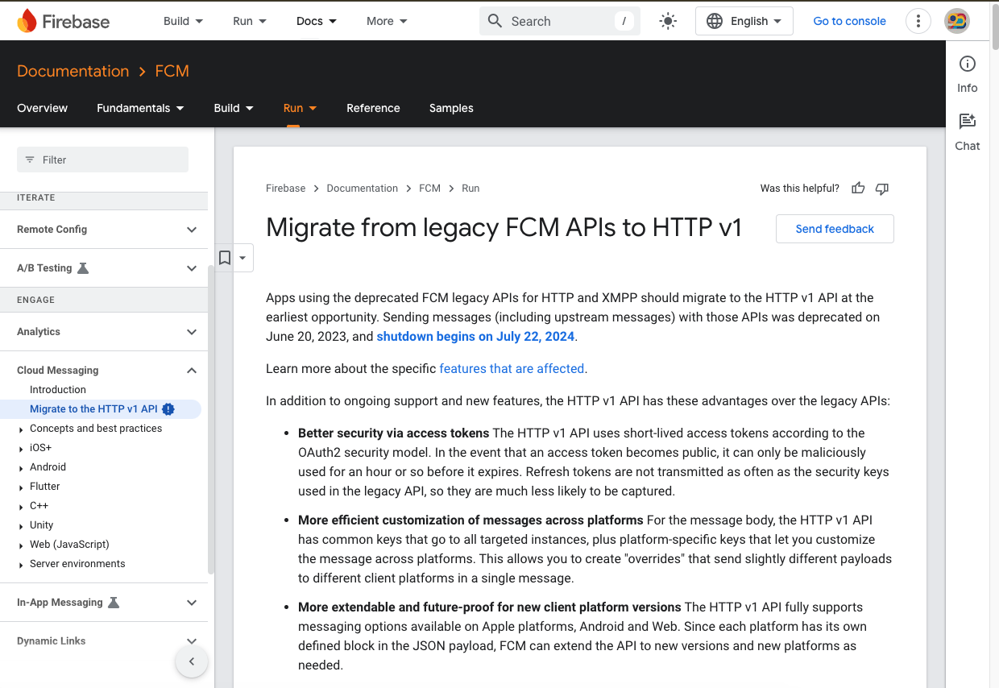
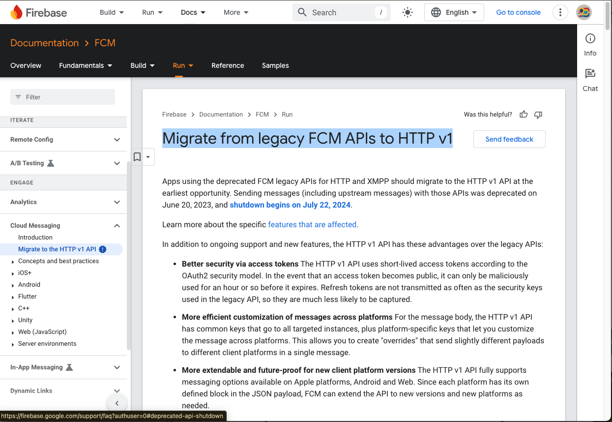
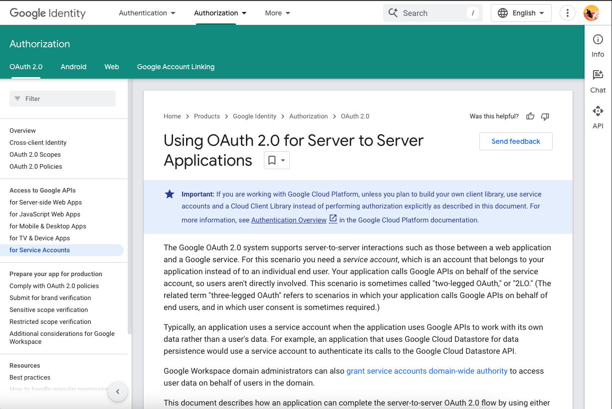

Firebase has brings a new policy for the FCM access token. Now, you need to create a new access token for FCM. You can create a new access token by following the steps below:

Before that see the case:

Firebase Console Image 



Google Cloud Console Image



Google Recommendation
 

[Link to the Google Recommendation](https://firebase.google.com/docs/cloud-messaging/migrate-v1?hl=en&authuser=0&_gl=1*1pij831*_ga*MTIzMTIyNjAxMC4xNzI0NzUyNTEy*_ga_CW55HF8NVT*MTcyNDgyMTk3MS41LjEuMTcyNDgyMTk4NS40Ni4wLjA.)

Solutions:

    1. Use Google Oath2 (Easy Way)
    2. Manually Rest API Implementation


# Use Google Oath2 (Easy Way)

You can use Google Oath2 to get the new access token. Here are the steps:

1. Go to your project in the Firebase Console.
2. In project settings, go to the Service  accounts tab.
3. Generate a new private key.
4. Download the private key file.

Now, you can use the private key file to get the new access token. Here is the code to get the new access token:


`Note this is dart code and i'm using googleapis_auth package to get the access token from the private key file. You can use the same code in any language by using the googleapis_auth package. Check you language support for googleapis_auth package.`

```dart
import 'package:http/http.dart' as http;
import 'package:googleapis_auth/auth_io.dart';

  

  Future<AccessCredentials> obtainCredentials() async {
    final Map<String, dynamic> json = await readAccountFile();
    var accountCredentials = ServiceAccountCredentials.fromJson({
      "private_key_id": json['private_key_id'],
      "private_key": json['private_key'],
      "client_email": json['client_email'],
      "client_id": json['client_id'],
      "type": "service_account"
    });
    final scopes = ['https://www.googleapis.com/auth/cloud-platform'];
    var client = http.Client();
    AccessCredentials credentials =
        await obtainAccessCredentialsViaServiceAccount(
            accountCredentials, scopes, client);

    client.close();
    print(
        "Oauth2 Credential -------------\n${credentials.toJson()}\n---------------------");
    return credentials;
  }

  // Service Account File
  Future<Map<String, dynamic>> readAccountFile() {
    try {
      final String jsonString = File(_serviceAccessFilePath).readAsStringSync();
      return Future.value(jsonDecode(jsonString));
    } on Exception catch (e) {
      return Future.error(e);
    }
  }
```

- How to use the above code [SEND OTP]:

```dart

Future<void> sendOTP() async {
    final credential = await obtainCredentials();
    final deviceToken = 'cNGXU81nSG6AMb8YYj1Ny4:APA91bGZpAgw_gp6bl6kfgN4wIxCZLROt1duQiv-B43X5ggev1OBFuG59r6UpLOwvWm5ubq27DM5ehPq5-Ykhvf3VbpiMGZk6wae25oG1mqVMw-5Bhv5Xo14DJ3_SaR2V1DhLVowMou9';
    final serviceURL = Uri.parse(
          'https://fcm.googleapis.com/v1/projects/hr-portal-e8a8c/messages:send');

    final client = http.Client();
    final response = await client.post(serviceURL,
      headers: {
        'Authorization': 'Bearer ${credential.accessToken.data}',
        'Content-Type': 'application/json',
      },
      body: jsonEncode({
        'message': {
          'notification': {
            'title': 'OTP',
            'body': 'Your OTP is 123456',
          },
          'data': {
            'category': 'leave',
            'type': 'accepted',
            'title': 'Only ABCD ',
            'body': 'Nothing-forground',
            'click_action': 'FLUTTER_NOTIFICATION_CLICK',
            'ticket-id': null
          },
          'token':
              deviceToken,
        },
      }),
    );

    print(response.body);
    client.close();
  }
```


`For More Details: Visit the`
[Google Oath2](https://firebase.google.com/docs/cloud-messaging/migrate-v1?hl=en&authuser=0&_gl=1*1pij831*_ga*MTIzMTIyNjAxMC4xNzI0NzUyNTEy*_ga_CW55HF8NVT*MTcyNDgyMTk3MS41LjEuMTcyNDgyMTk4NS40Ni4wLjA.)

# Manually Rest API Implementation

You can also get the new access token by using the `Rest API` and the `private key` file along with `RSA algorithm`. Here are the steps:





`For More Details: Visit the`
 [Migration](https://developers.google.com/identity/protocols/oauth2/service-account#callinganapi)
